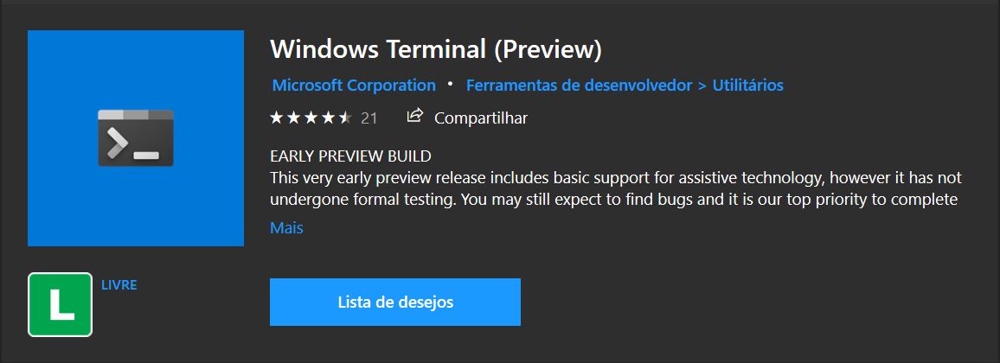
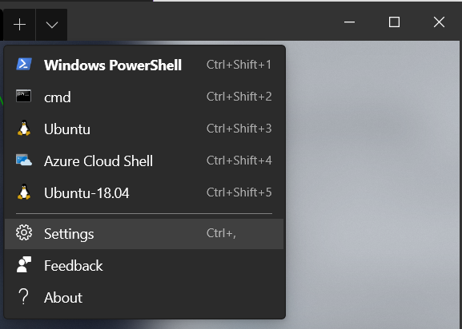
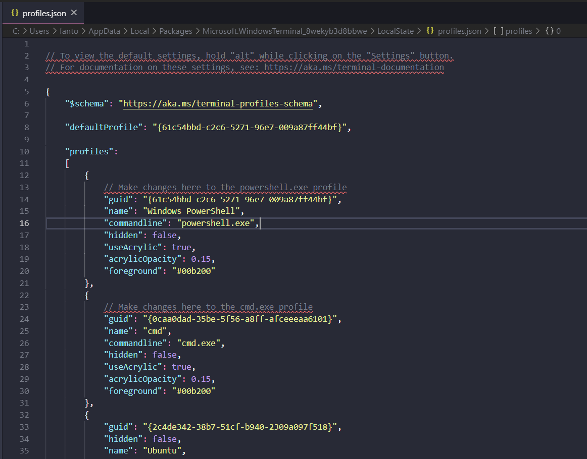
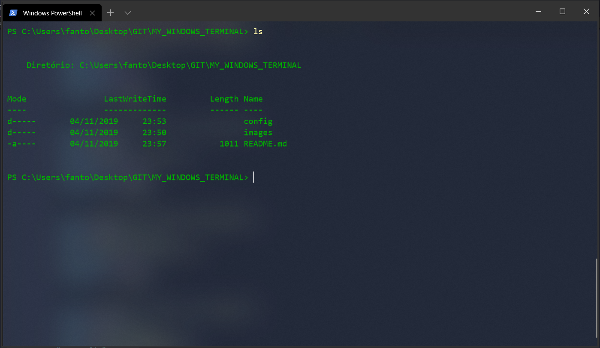
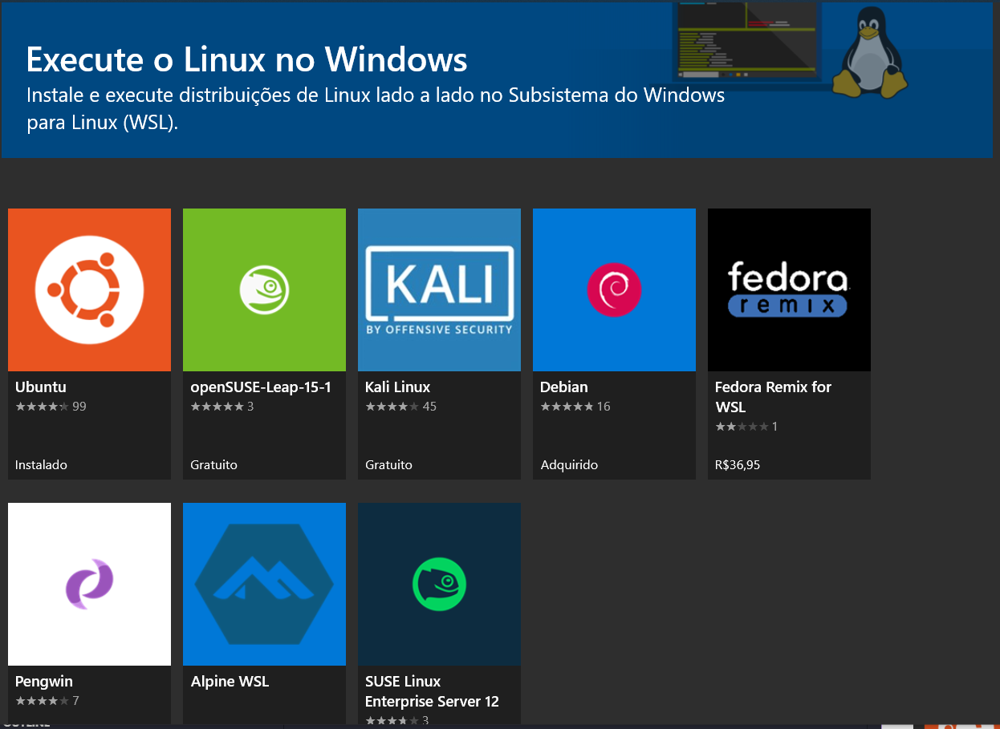

# Welcome to Windows Terminal

* **Windows Terminal** is the new Shell CLI controler to Microsoft Windows 10 version 18362.0 or Later
* It still in Beta Version but it works interesting!!

### The idea of this Repo

* I create this Repo to tell how the Windows Terminal works and the configurations files i used to make him like i wanted :smile:

### Download

* To Download go to `Microsoft Store` and Search for [Windows Terminal](https://www.microsoft.com/store/productId/9N0DX20HK701) (or click on the previous link)
* You will se something like that:



### Configuration

* To config the terminal you need to change a `profile.json` located at:



* Open where you wanted but it works good at `Visual Studio Code`



* If you want there is my **profile.json** on `config` folder on this Repo

### Understand the Configuration

* My Simple configuration is like below



* To make the background transparent put the following commands on the profile you wanted(in that case on Powershell)

```json
"useAcrylic": true,
"acrylicOpacity": 0.15
```

* To change the Font Color (like i put it green) put this Hex Color code like below on your preference profile:

```json
"foreground": "#00b200"
```

* To use other kinds of Terminal you will need to Download on Microsoft Store, the list of Terminals are:



* To make the upbar black like the example you need to change all the theme from Windows 10 but this is our next topic

### Change Windows 10 Theme

